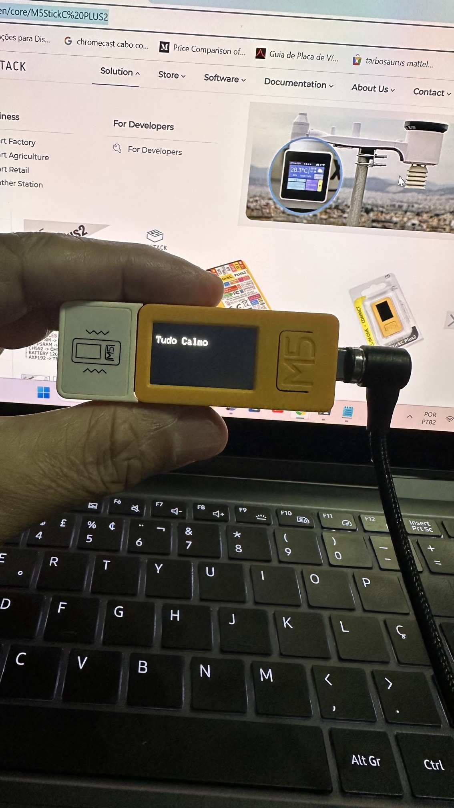
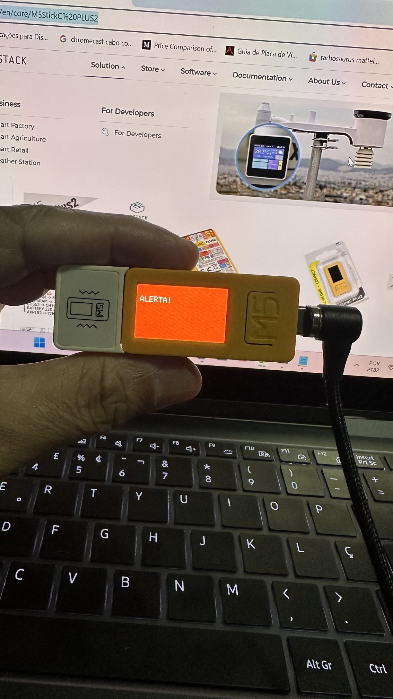
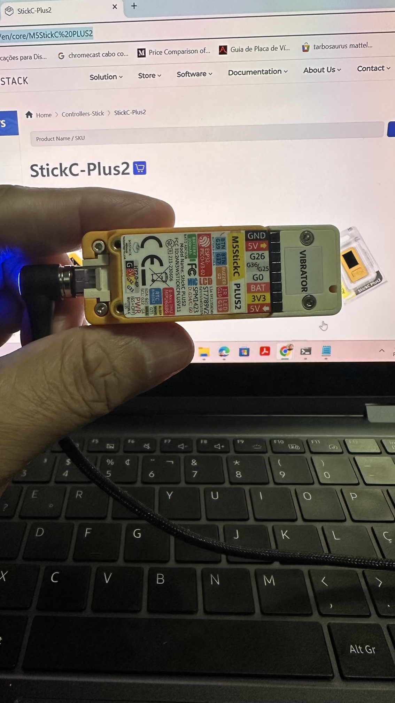

# 🚀 M5StickC Plus2 - Activity Monitor (ESP-IDF)

Projeto de estudo evolutivo utilizando **ESP-IDF + M5Unified** no
M5StickC Plus2.\
Study project using **ESP-IDF + M5Unified** on M5StickC Plus2.

------------------------------------------------------------------------

# 🇧🇷 Português

## 📚 Visão geral

Este projeto foi desenvolvido de forma **didática e evolutiva**,
dividido em fases:

-   Fase 1 → Setup + leitura da IMU
-   Fase 2 → Detecção de movimento + alerta com vibração

------------------------------------------------------------------------

## 🎯 Objetivo

Construir um sistema embarcado capaz de:

-   Ler sensores (acelerômetro)
-   Detectar movimento
-   Exibir informações na tela
-   Gerar alerta físico (vibração)

------------------------------------------------------------------------

## 🧱 Estrutura do projeto

    .
    ├── README.md
    ├── docs/
    │   ├── fase1.md
    │   └── fase2.md
    └── main/
        ├── main.cpp
        ├── main_fase1.cpp
        ├── vibrator.c
        └── vibrator.h

------------------------------------------------------------------------

## ⚙️ Como executar

``` bash
idf.py build
idf.py flash monitor
```

Execute sempre na raiz do projeto.

------------------------------------------------------------------------

## 🧠 Conceito da Fase 2

### Fluxo do sistema:

Tudo Calmo → Movimento → ALERTA → Parado → Tudo Calmo

------------------------------------------------------------------------

## 🔍 Lógica simplificada

1.  Ler IMU
2.  Calcular magnitude
3.  Calcular delta
4.  Comparar com threshold
5.  Controlar tempo
6.  Mudar estado

------------------------------------------------------------------------

## 💻 Código principal (resumo)

``` cpp
float delta = fabs(accel - last_accel);

if (delta > THRESHOLD) {
    movement_start = now;
} else {
    still_start = now;
}
```

------------------------------------------------------------------------

## 🔌 Vibração

-   Utiliza GPIO 26
-   Liga/desliga motor vibratório

------------------------------------------------------------------------

## ⚠️ Problemas comuns

-   Threshold alto → não detecta movimento
-   GPIO errado → não vibra
-   Falta de extern "C" → erro de linker

------------------------------------------------------------------------

## 🧠 Aprendizados

-   Máquina de estados
-   Processamento de sinais
-   Integração C/C++
-   Controle de hardware

------------------------------------------------------------------------

## 🚀 Próximos passos

-   Melhorar UX
-   Vibração não bloqueante
-   Filtro de ruído

------------------------------------------------------------------------

# 🇺🇸 English

## 📚 Overview

This project was built in a **step-by-step learning approach**, divided
into phases:

-   Phase 1 → Setup + IMU reading
-   Phase 2 → Motion detection + vibration alert

------------------------------------------------------------------------

## 🎯 Objective

Build an embedded system capable of:

-   Reading sensors (accelerometer)
-   Detecting motion
-   Displaying data
-   Triggering physical alerts (vibration)

------------------------------------------------------------------------

## 🧱 Project structure

    .
    ├── README.md
    ├── docs/
    │   ├── fase1.md
    │   └── fase2.md
    └── main/

------------------------------------------------------------------------

## ⚙️ How to run

``` bash
idf.py build
idf.py flash monitor
```

Run from project root.

------------------------------------------------------------------------

## 🧠 Phase 2 concept

### System flow:

Calm → Movement → ALERT → Still → Calm

------------------------------------------------------------------------

## 🔍 Core logic

1.  Read IMU
2.  Compute magnitude
3.  Compute delta
4.  Compare with threshold
5.  Track time
6.  Change state

------------------------------------------------------------------------

## 💻 Code snippet

``` cpp
float delta = fabs(accel - last_accel);
```

------------------------------------------------------------------------

## 🔌 Vibration

-   Uses GPIO 26
-   Turns motor ON/OFF

------------------------------------------------------------------------

## ⚠️ Common issues

-   High threshold → no detection
-   Wrong GPIO → no vibration
-   Missing extern "C" → linker error

------------------------------------------------------------------------

## 🧠 Learnings

-   State machines
-   Signal processing
-   C/C++ integration
-   Hardware control

------------------------------------------------------------------------

## 🚀 Next steps

-   Improve UX
-   Non-blocking vibration
-   Signal filtering

-------------------------------------------------------------------------


## 📸 Imagens do Projeto | Project Images

### 🇧🇷
Imagens reais do desenvolvimento e testes.

### 🇺🇸
Real images from development and testing.





----------------------------------------------------------------------------

## 🧰 Hardware utilizado | Hardware Used

### 🇧🇷
- M5StickC Plus2  
- Motor vibratório  

### 🇺🇸
- M5StickC Plus2  
- Vibration motor  

### 🔗 Links

- M5StickC Plus2: https://docs.m5stack.com/en/core/M5StickC%20PLUS2
- Motor vibratório: https://docs.m5stack.com/en/hat/HAT-Vibrator